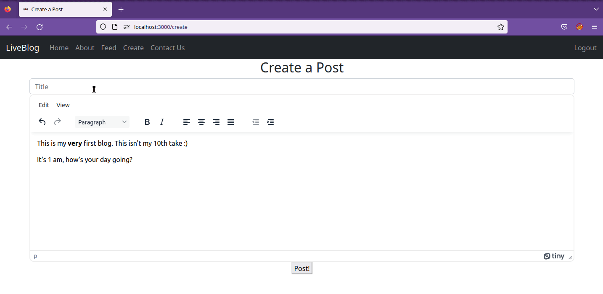

# liveblog 📝
> Team Fun | Software Engineering

<p align="center">

</p>
<p align="center">https://final-project-9b3c9.firebaseapp.com</p>

## What is this? 🧐
Just a blog website. Make posts. Read posts. Interact with posts. Whatever people do these days.

<p align="center">

</p>

- Supports Google authentication
- Allows writing with more than just plain text (bold, text sizes, etc.)
- Global Feed of what everyone is saying!

### Tech Stack
- 🔥 Firebase for hosting, authentication, and database
- 🚄 Node.js/Express back-end code
- 🕸️ Just good ol' HTML, CSS, and JS

## Local Build
> Assuming you have a firebase project and want to put this on it

**Dependencies**: Node.js + npm 
```shell
$ npm install -g firebase-tools
$ firebase login
$ npm run build
$ firebase emulators:start
```

You'll also need your private admin key to link your Node.js code to Firebase (look for `privatekey.json` in `index.js`)

## TODO
- [ ] Rewrite authentication to be all server-side (I don't know why firebase likes client-side so much)
- [ ] Add comment abilities
- [ ] Add a dashboard for your user
    - [ ] Enable users to change names, add profile pictures, change email
- [ ] Allow posts to be deleted
- [ ] Fix security bugs
- [ ] Refactor and use TypeScript?

We made this as part of a school project, but feel free to make any contributions or fork this project and make it your own.
